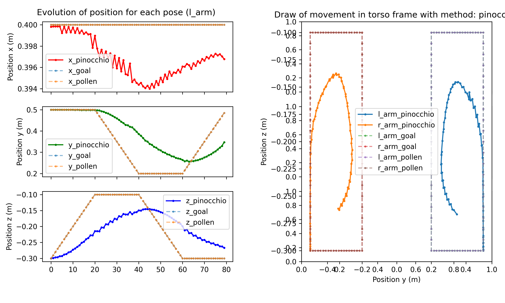
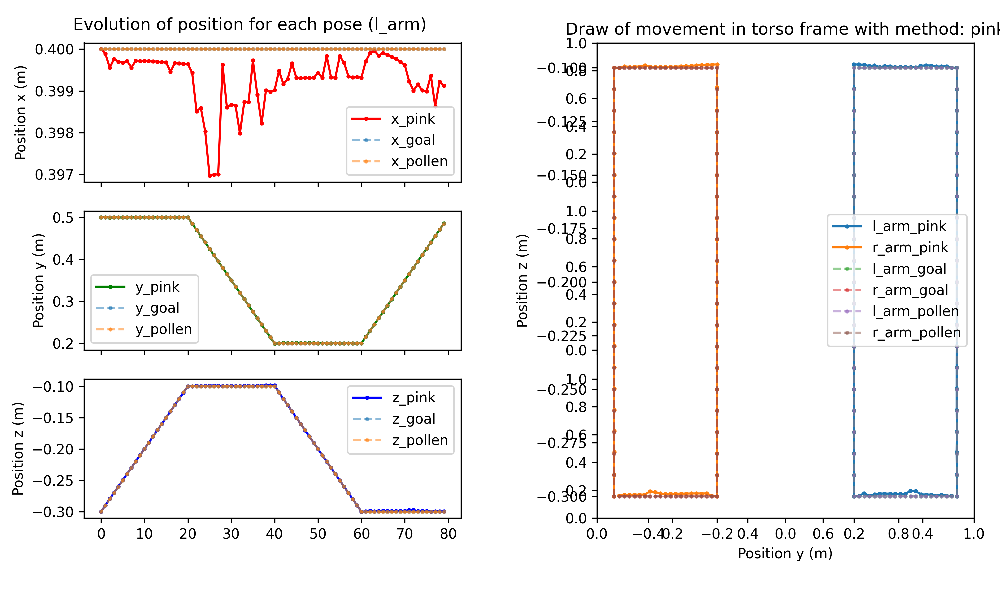
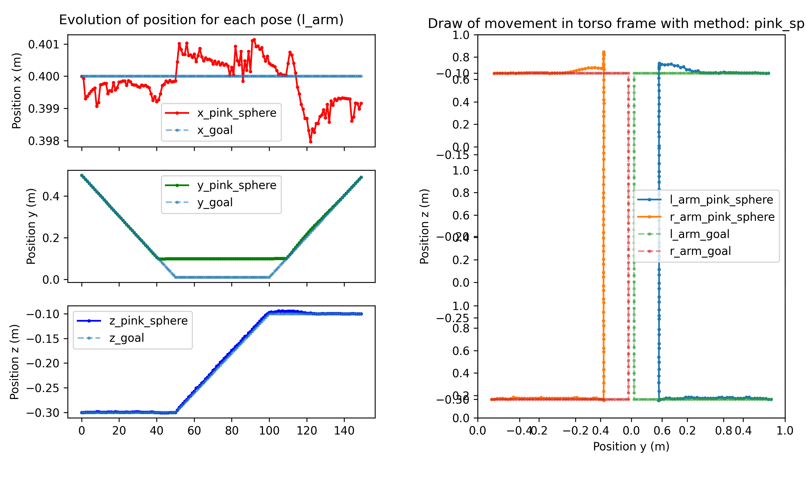
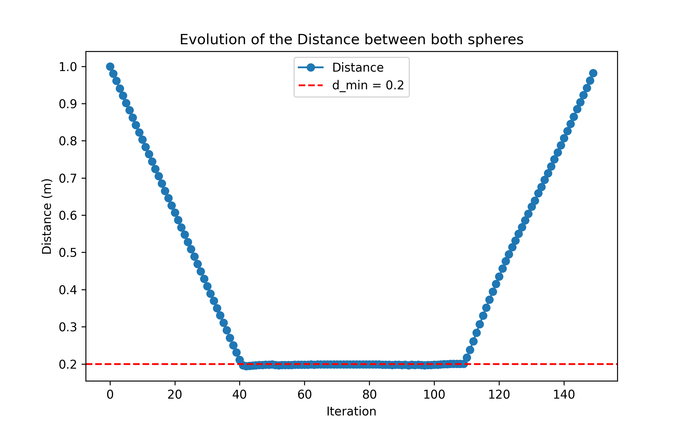

# 📖 Report

## ⁉️ Context

[Pollen](https://www.pollen-robotics.com/), a start-up located in Bordeaux, develops [Reachy](https://github.com/pollen-robotics), an anthropomorphic robot primarily used for immersive teleoperation applications. In these applications, enhancing the user's sense of control is essential but must not come at the expense of safety. It is therefore crucial to ensure the optimal execution of commands while respecting both the robot's intrinsic and extrinsic constraints. Furthermore, continuously providing feedback on the robot's capabilities can contribute to this sense of control by reducing the gap between the commanded action and the one actually performed.  

The objective of the project is to explore alternatives to the inverse kinematics approach implemented by Pollen within the Reachy robot architecture, particularly in the context of teleoperation.

### Input
We rely on Reachy2’s existing hardware and software, including its analytical inverse kinematics solver. While an implementation for handling joint limits exists, it lacks robustness and needs improvement.

### Output
Our goal is to enhance motion control strategies to ensure smooth and reliable teleoperation, even near singularities and joint limits. This will involve refining existing solutions and developing new approaches to improve accuracy and responsiveness.

## 🔎 Implemented approch

To address this challenge, we conducted a [state-of-the-art review](docs/bibliography/etat_de_l_art.pdf) to explore alternative inverse kinematics approaches within Reachy2’s architecture. Based on this, we defined the following action plan:

* Implement inverse kinematics resolution using the Jacobian and the [Pinocchio library](https://github.com/stack-of-tasks/pinocchio).
* Solve inverse kinematics using a Quadratic Programming (QP) approach with the [Pink library](https://github.com/stephane-caron/pink).
* Introduce constraints and experiment with different combinations.
* Perform tests to compare methods, analyze results, and provide critical insights.

## 📈 Analysis of results

### Realisations 

Following the results of the state of the art, an initial inverse kinematics solution was developed using the Jacobian-based iterative algorithm. This implementation is based on the Pinocchio library and is largely inspired by [this example from the official documentation](https://gepettoweb.laas.fr/doc/stack-of-tasks/pinocchio/master/doxygen-html/md_doc_b_examples_d_inverse_kinematics.html).

This approach serves as an intermediate step before integrating a quadratic programming (QP) resolution and implementing constraints. To achieve this, the Pink library, built on Pinocchio, is used. It directly incorporates system limits by leveraging the robot's URDF model.

Based on this foundation, additional constraints can be introduced, such as barriers or limits. A first proposal is to [add spherical barriers](https://stephane-caron.github.io/pink/barriers.html#module-pink.barriers.body_spherical_barrier) around the arm end-effectors to ensure a minimum distance between them and prevent collisions.

The joint and velocity limitation were also modified to take Reachy limitation into account and an acceleration limitation was implemented to prevent Reachy's end effector to have high speed movement on very short time, often resulting in end effector tremors.

A subtask has also been implemented to minimize the joint angle, it allow reachy to prefer movement that are far from its joints limits. 
This subtask can also be used to block selected joints if necessary like, for example, if only a selected joint is wanted, to move, other joints is prefered to be blocked.

This subtask could also have room for improvement to allow some highly movable joint like the shoulder pitch, the elbow yaw or the wrist yaw to conserve their full possible rotation while also rewinding the joint if it is about to hit its joint limit. 

### Results

Tests have been implemented, along with metric collection, to compare the different approaches.

A first test involves asking Reachy2 to  with each of its hands 

#### Pinocchio
The resolution using Pinocchio delivers limited performance and fails to accurately follow the dynamic reference. This outcome was expected, as this method relies on iterative convergence, making it unsuitable for real-time teleoperation tasks.

More graphics for this method are available [in this folder](../../assets/csv_files_for_metrics/pinocchio).

#### Pink
This approach performs significantly better, managing to follow the dynamic reference with some minor inaccuracies. While this iterative method cannot compete with the current analytical resolution used by Pollen, it stands out for its flexibility in integrating constraints.

More graphics for this method are available [in this folder](../../assets/csv_files_for_metrics/pink).

#### Pink and Body Spherical barrier
One possible approach is to integrate spherical barriers at the end-effectors. , the hands are required to position themselves at the center of the torso, with a maximum deviation of 0.05 m. With the barrier in place, where d_min = 0.2 m, the hands do not collide.
This contrasts with the current Pollen implementation, which stops the program and returns an error in such a situation.

More graphics for this method are available [in this folder](../../assets/csv_files_for_metrics/pink_sphere).
